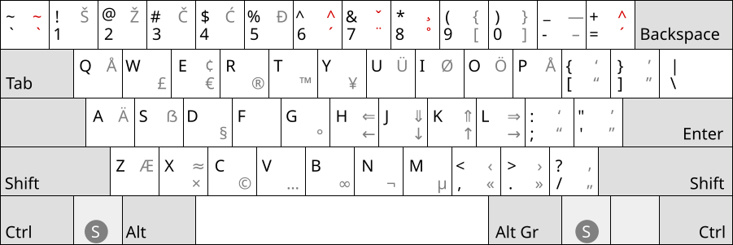

# us_cat - xkb layout

The `us_cat` Layout is a xkb keybord layout map intended for use
with a us keyboard for typing primarily german but also providing
diacritic characters for french and some slavic languages in latin script.

There is also version for use with de keyboards included.

## installation

Place the files in `/usr/share/X11/xkb/symbols/` 
and use as layout `us_cat` or `de_cat` with variant `cat` respectively.

> **Note**: on upgrade delete `/var/lib/xkb/*.xkm` and manually re-apply the layout or reboot.

The python script `evdev_xml_entry.py` will directly modify your system's `evdev.xml`
to show the layouts in the keyboard configuration gui. (Execute as root)

## other OSes

Versions for Windows and OSX are included in the respective folders.

## open questions

- repurpose `<CAPS>`?

